# ✨ Vast AI Operating System

A Flutter web project showcasing the **VAST AI Operating System** slides.  
This repository includes all slides and assets demonstrating the architecture, AI capabilities, and future of VAST AI OS.

---

## 📑 Table of Contents

- 🖥️ [Introduction: What is an Operating System](#introduction-what-is-an-operating-system) – Overview of OS basics.  
- 🤖 [Introduction: Why AI Needs a New OS](#introduction-why-ai-needs-a-new-os) – Motivation for AI-native OS.  
- 🔄 [The Revolution of Operating System](#the-revolution-of-operating-system) – AI needs a new OS for full potential.  
- 🧠 [The VAST AI Operating System](#the-vast-ai-operating-system) – Data-centric OS for AI workloads.  
- 🌐 [Pioneering the Future of AI Infrastructure](#pioneering-the-future-of-ai-infrastructure) – VAST OS built for scale & AI.  
- ⚙️ [The Operating System for the Thinking Machine](#the-operating-system-for-the-thinking-machine) – Unified, high-performance, self-optimizing OS.  
- 🏗️ [Meet VAST Data’s DASE Architecture](#meet-vast-datas-dase-architecture) – Scalable architecture for infinite data & compute.  
- 🔐 [Inside the AI Operating System](#inside-the-ai-operating-system) – Core components enable performance and security.
- 💾 [VAST DataStore: Unified, Scalable Flash Storage](#vast-data-store-unified-scalable-flash-storage) – High-performance AI-optimized flash storage.  
- ⚡ [VAST’s AI Infrastructure: Key Engines & Capabilities I](#vasts-ai-infrastructure-key-engines-capabilities-i) – InsightEngine & AgentEngine power AI at scale.  
- 🔧 [VAST’s AI Infrastructure: Key Engines & Capabilities II](#vasts-ai-infrastructure-key-engines-capabilities-ii) – DataEngine & Unified Platform integration.  
- 📊 [VAST DataBase: Revolutionizing Analytics & AI Performance](#vast-database-revolutionizing-analytics-ai-performance) – Exabyte-scale AI & analytics.
- ☁️ [VAST DataSpace: Revolutionizing Edge-to-Cloud Data Access](#vast-dataspace-revolutionizing-edge-to-cloud-data-access) – Fast, global, hybrid cloud-ready data.  
- 🔮 [Future of VAST AI Operating System](#future-of-vast-ai-operating-system) – Real-time, scalable, unified AI platform.  
- 👥 [Team Members](#team-members) – Contributors of this project.

---

## 📸 Slides

🖥️ Introduction: What is an Operating System

Basic overview of operating systems: software that manages hardware, resources, and provides services to applications.  

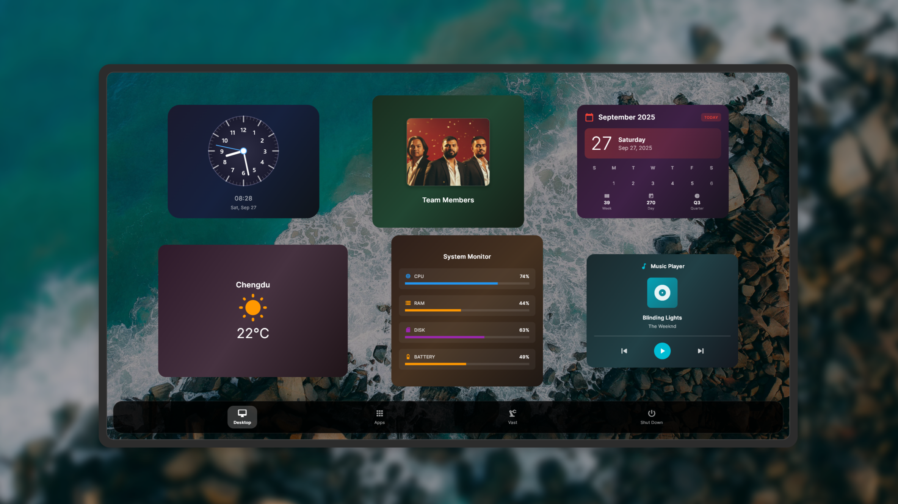

🤖 Introduction: Why AI Needs a New OS

Current OSs are not built for AI-native apps. A new foundation is needed to harness AI’s full power.  

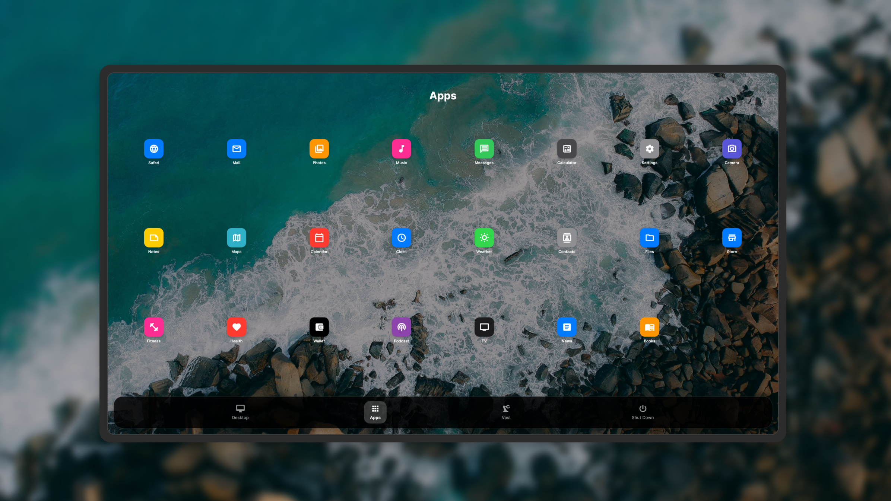

🔄 The Revolution of Operating System

Just as PCs and smartphones needed the right OS to unlock their potential, AI now demands a new foundation.  

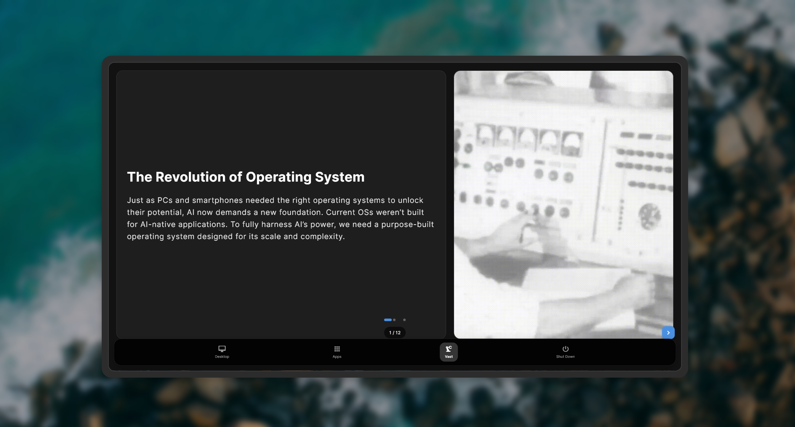

🧠 The VAST AI Operating System

AI OS is a data-centric environment designed to power modern AI workloads and data-driven applications.  

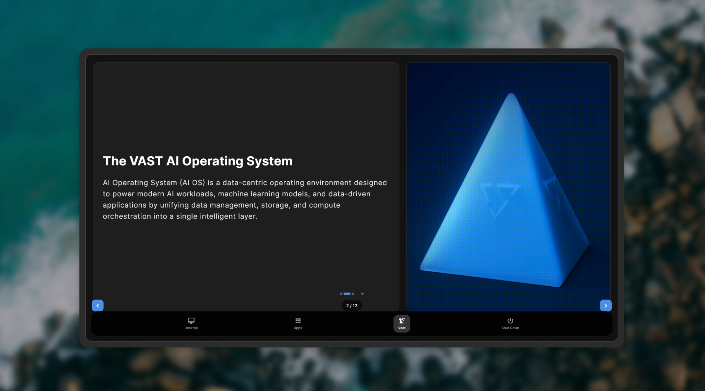

🌐 Pioneering the Future of AI Infrastructure

AI & Deep Learning, Exponential Growth, DASE, Transformative Solution, Future-Proof Data Foundation.  

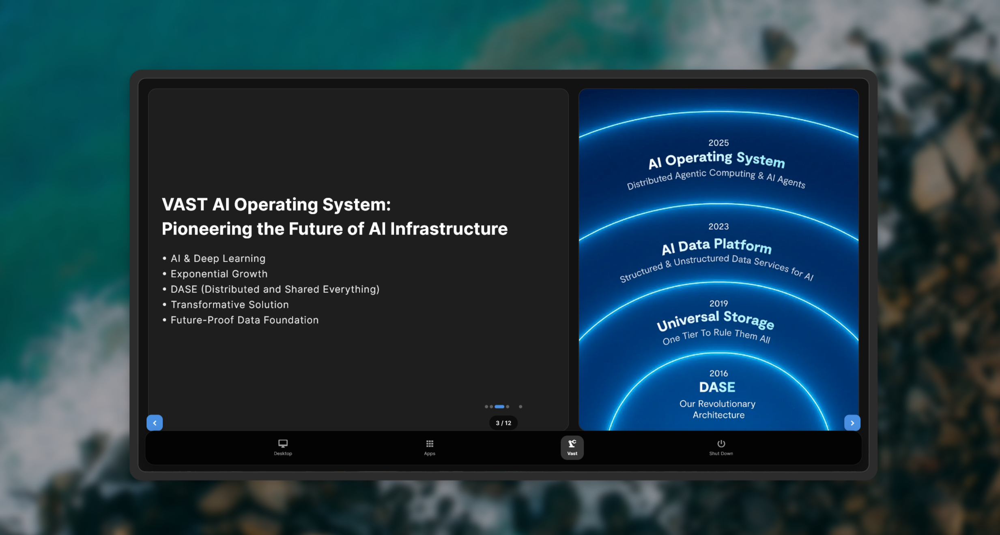

⚙️ The Operating System for the Thinking Machine

Unified Data Management, Scalable Architecture, AI-Native Design, Global Data Fabric, Real-Time Processing.  

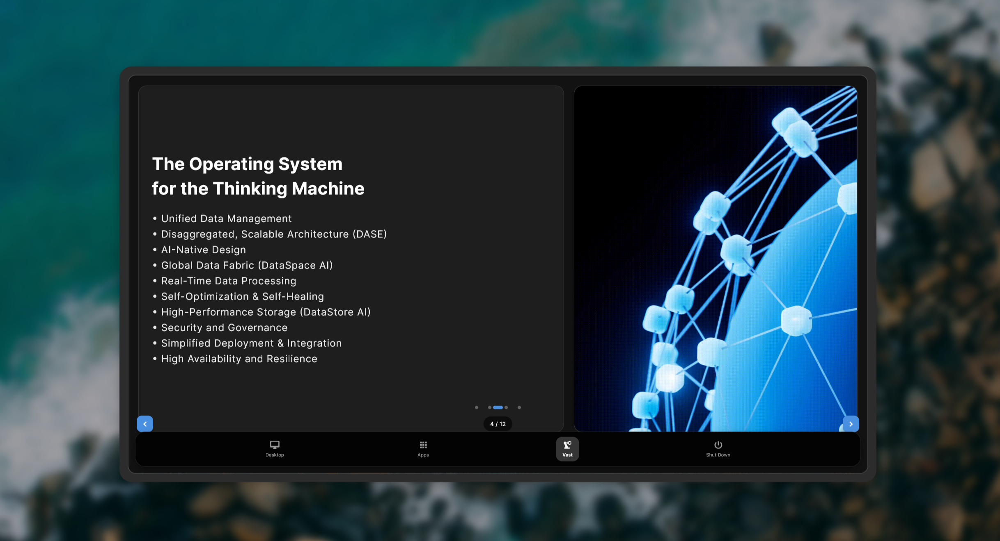

🏗️ Meet VAST Data’s DASE Architecture

VAST introduces DASE – scalable architecture. Infinite storage lifecycle, flexible CPU scaling, simplicity & cost efficiency.  

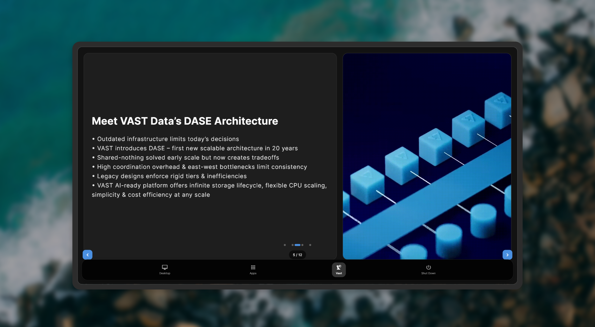

🔐 Inside the AI Operating System

Built on DASE architecture, engineered to break barriers to scale, performance, and security.  

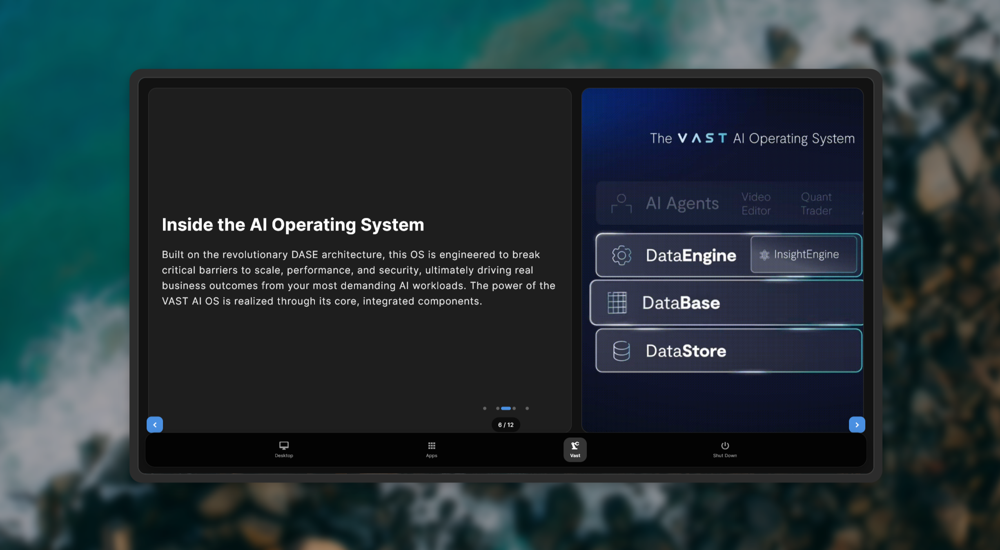

💾 VAST DataStore: Unified, Scalable Flash Storage

All-Flash Storage, GPU-Optimized, Scalable, Similarity-based data reduction, Multi-Protocol access, Snapshots & Replication.  

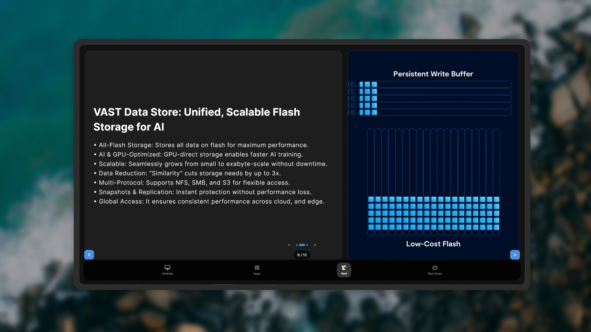

⚡ VAST’s AI Infrastructure: Key Engines & Capabilities I

InsightEngine: real-time ingestion & retrieval. AgentEngine: manages AI agents at scale.  

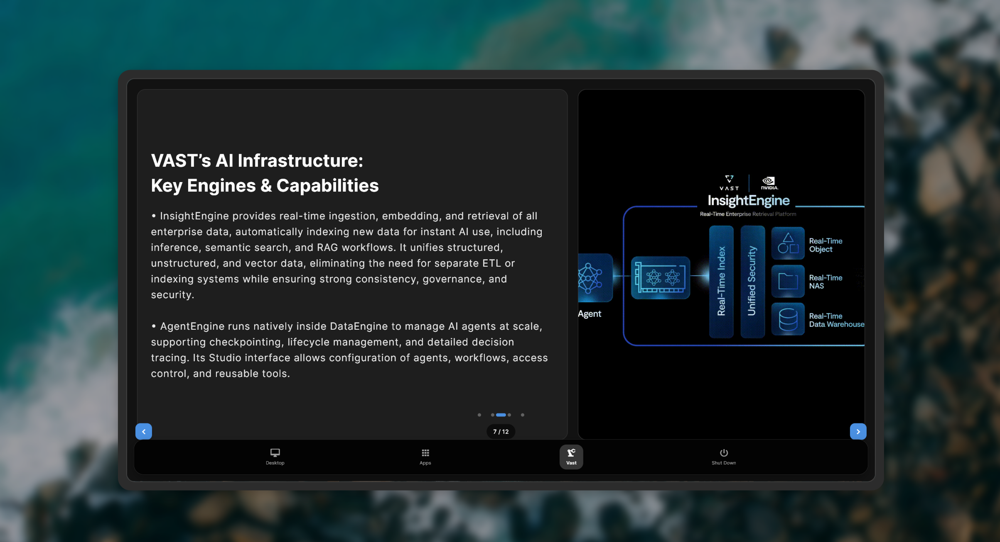

🔧 VAST’s AI Infrastructure: Key Engines & Capabilities II

DataEngine: real-time workflows with triggers and custom logic. Unified platform integrating storage, indexing, compute, and orchestration.  

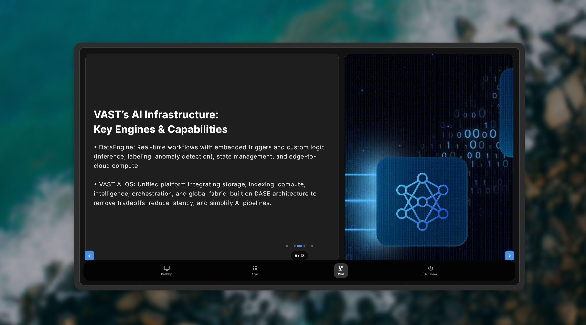

📊 VAST DataBase: Revolutionizing Analytics & AI Performance

Hybrid Power, Cost-Efficient, Optimized Storage, Scalable ACID, Disaggregated Design, Unified Platform, AI & Analytics Ready.  

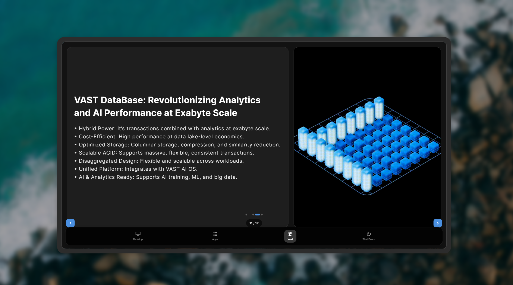

☁️ VAST DataSpace: Revolutionizing Edge-to-Cloud Data Access

Fast Access, Decentralized Locks, Path-Based Sync, Global Namespace, Replication, Hybrid Cloud Integration, AI & Big Data Ready.  

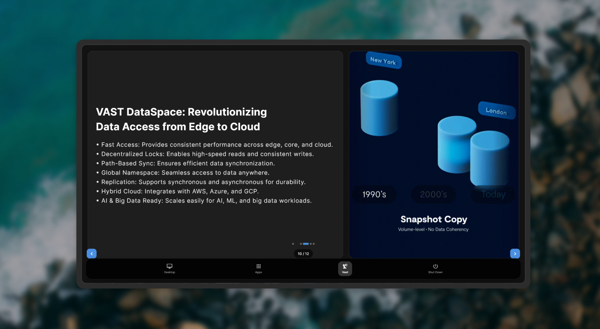

🔮 Future of VAST AI Operating System

Real-Time Processing, Low Latency, Immediate Action, Scalable Architecture, Unified AI Platform, AI & ML Optimization, Hybrid Cloud Ready, Enterprise Reliability.  

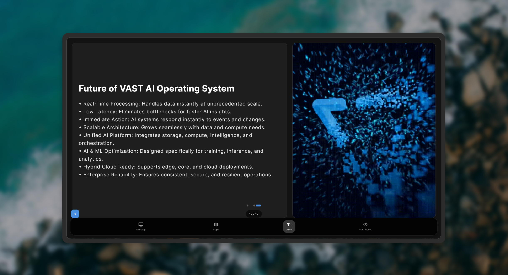

👥 Team Members

The contributors and developers behind this project:  

- [Rafi Ahmed](https://github.com/codewith-rafi)  
- [Iftekhar Alam Fahim](https://github.com/iftekharalamfahim)  
- [Ridoy Kumar Adhikary](https://github.com/ridoy-adhikary)  

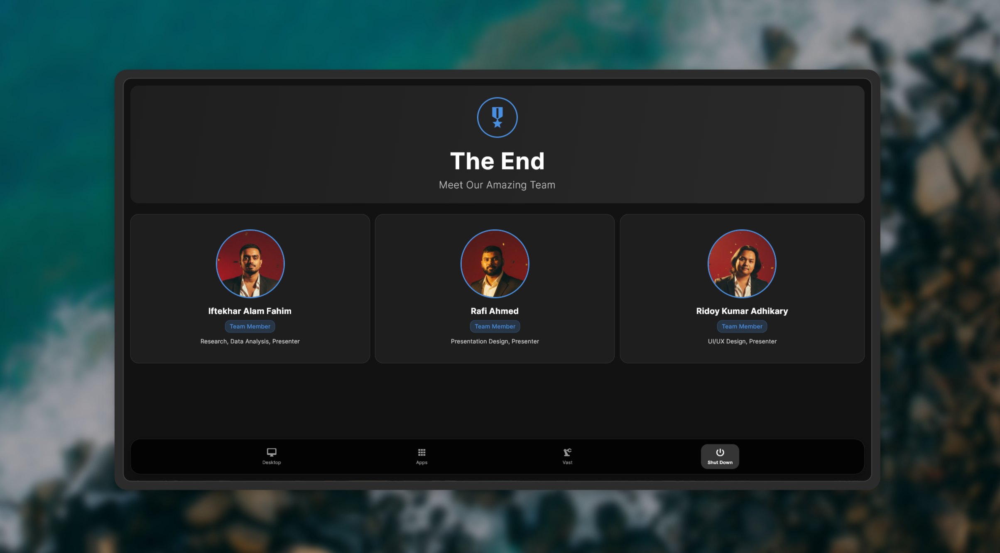

---

## 📜 License

MIT License © 2025
